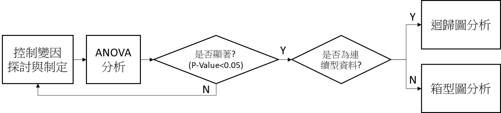
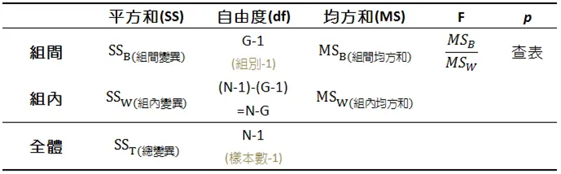

# 福豐國中科學展覽
# 實驗結果與分析
## 實驗流程說明
我們的分析方法如下圖:
1. 首先探討與制定控制變因
2. 採用ANOVA分析, 針對實驗組與對照組進行分析. 我們採用P-value為0.05為標準, 小於此標準為顯著.
3. 如果ANOVA分析結果不顯著, 則重新探討與制定控制變因 (回到第1點).
4. 若ANOVA分析結果顯著, 我們再判斷控制變因是否為連續型資料. 若為連續型資料, 則採用迴歸分析繼續分析控制變因, 反之則採用箱型圖分析.

## ANOVA分析介紹
ANOVA分析的精神就是**最大化組間變異**與**最小化組內變異**. **最大化組間變異**目的是希望實驗的控制變因是有顯著的, **最小化組內變異**的目的是希望實驗水準夠高, 量測誤差很小. 因此ANOVA分析制定: $F=\frac{MS_B}{MS_W}$, 其中${MS_B}$為組間均方和, 我們期望越大越好, 代表控制變因顯著. ${MS_W}$為組內均方和, 越小越好, 代表量測誤差小. 最後透過F查表P-Value, 我們設定0.05為顯著水準.

